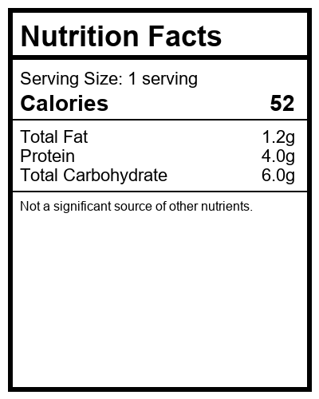

# 🥗 Ingredient Replacer

> Paste a recipe URL and get instant, diet-aware ingredient swaps — powered by [foodBERT](https://github.com/ChantalMP/Exploiting-Food-Embeddings-for-Ingredient-Substitution) food embeddings, USDA & Nutritionix nutrition data, and an FDA-style nutrition label.

<p align="left">
  <a href="https://ingredient-replacer.vercel.app/"></a>
  
  
  
  
</p>

**🌐 Live demo: [ingredient-replacer.vercel.app](https://ingredient-replacer.vercel.app/)**
> The hosted demo uses a precomputed foodBERT cache, so swap suggestions may not be available for every ingredient.

---

## ✨ What it does

Upload a recipe URL and the app will:

- **Extract** the ingredient list from the recipe page
- **Flag** ingredients that conflict with a selected diet (vegan, vegetarian, gluten-free, keto, low-carb, paleo, …)
- **Suggest** ranked ingredient swaps for the flagged items, scored by foodBERT similarity and nutritional distance
- **Summarize** how each swap changes the recipe's nutrition
- **Render** an FDA-style nutrition label for the recipe

<p align="center">
  
</p>

---

## 🧱 Tech stack

| Layer | Technology |
| --- | --- |
| Frontend | Next.js 15, React 19, Material UI 7 |
| Backend | FastAPI + Flask (Python) |
| ML / NLP | foodBERT embeddings, Annoy (approximate KNN), Transformers, spaCy, NLTK |
| Data sources | USDA FoodData Central, Nutritionix, Open Food Facts, Suggestic |
| Imaging | Pillow (nutrition label rendering) |

---

## 🗂️ Project structure

```
Ingredient_Replacer/
├── src/                  # Backend: APIs, enrichment, swap & nutrition logic
├── app-landing-page/     # Next.js + Material UI frontend
├── foodBERT/             # Food embedding model & substitution code
├── suggestic_integration/# Suggestic recipe/ingredient data pipeline
├── data enrichment/      # Nutritionix/USDA enrichment scripts
├── scripts/              # Standalone data-prep & batch utilities
├── data/                 # Curated input datasets & presets
├── outputs/              # Generated swap/enrichment results & logs
├── tests/                # Pytest backend + pipeline tests
└── docs/                 # API reference, PRDs, plans & assets
```

---

## 🚀 Getting started

### Prerequisites
- Python 3.10+
- Node.js 18+

### 1. Backend APIs

```bash
pip install -r requirements.txt

# Swap suggestions + ingredient enrichment (FastAPI)
uvicorn src.ingredient_suggestion_api:app --reload

# Nutrition label (Flask)
python src/nutrition_label_api.py
```

### 2. Frontend

```bash
cd app-landing-page
npm install
npm run dev
```

Then open the app, paste a recipe URL, pick your diet(s), and submit.

---

## 🔌 API overview

| Endpoint | Framework | Purpose |
| --- | --- | --- |
| `POST /suggestions` | FastAPI | Ranked ingredient swaps for flagged ingredients |
| `POST /enrich_ingredients` | FastAPI | Nutrition, categories & dietary flags per ingredient |
| `GET /diet_rules` | FastAPI | Available diets and their restrictions |
| `POST /nutrition-label` | Flask | FDA-style nutrition label image + summary |

Full request/response schemas are in **[docs/API_DOCS.md](docs/API_DOCS.md)**.

**Example — `POST /suggestions`:**

```json
{
  "ingredients": ["egg", "milk"],
  "diets": ["keto", "vegan"]
}
```

---

## 🧪 Testing

```bash
# Backend / pipeline tests
pytest tests/

# Frontend tests
cd app-landing-page && npm test
```

---

## ♻️ Regenerating the foodBERT swap cache

Swap suggestions are served instantly from a precomputed cache. To refresh it after
adding new ingredients:

```bash
python foodBERT/foodbert_embeddings/precompute_foodbert_swaps.py
```

This regenerates `foodBERT/foodbert_embeddings/foodbert_swap_cache.json`. Restart the
backend afterward to load the new cache.

---

## 📚 Documentation

- **[API reference](docs/API_DOCS.md)** — endpoint schemas and dietary keys
- **[docs/PRD_Markdown/](docs/PRD_Markdown/)** — product requirements & design docs
- **[docs/planning/](docs/planning/)** — implementation plans, checklists & notes

---

## 🙏 Acknowledgements

Ingredient substitution builds on the [foodBERT food-embedding work by Chantal Pellegrini et al.](https://github.com/ChantalMP/Exploiting-Food-Embeddings-for-Ingredient-Substitution). Nutrition data is sourced from USDA FoodData Central, Nutritionix, and Open Food Facts.
